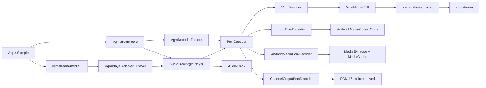

# vgmstream-android

Android library wrapper around [vgmstream](https://github.com/vgmstream/vgmstream).

## Features

- Android/Kotlin API for decoding vgmstream-supported game audio.
- JNI wrapper around native vgmstream.
- `AudioTrack` player wrapper for simple playback.
- Optional Media3 `Player` adapter module.
- PCM decoder API for custom playback pipelines.
- Seek, duration, sample rate, channel count, and loop info.
- Loop count, fade length, fade delay, loop mode, downmix, and channel output settings.
- Shared libraries built for:
  - `arm64-v8a`
  - `armeabi-v7a`
  - `x86_64`

## Architecture



The repository is split into two publishable Android library modules:

- `vgmstream-core`: the decoder, JNI bridge, native build, fallback decoders, settings model, and `AudioTrackVgmPlayer`.
- `vgmstream-media3`: a small optional Media3 integration module with `VgmPlayerAdapter`, which exposes the core player through the Media3 `Player` API.

`vgmstream-core` has three main layers:

- Kotlin API layer: `VgmPlayer`, `AudioTrackVgmPlayer`, `VgmDecoderFactory`, `PcmDecoder`, and `VgmSettings`.
- JNI/native layer: `VgmNative` calls `src/main/cpp/vgmstream_jni.cpp`, which links native vgmstream into `libvgmstream_jni.so`.
- Decoder fallback layer: Android `MediaCodec`-based decoders are used for LOPUS/Nintendo Opus and regular Android-supported Opus media when native vgmstream cannot open the file.

### Decoder Flow

`AudioTrackVgmPlayer` accepts an Android `Uri`, copies it into app cache, then opens a `PcmDecoder`.

The decoder selection order is:

1. Native vgmstream via `VgmDecoderFactory` and `VgmNative`.
2. `LopuPcmDecoder` for Nintendo/Switch Opus and LOPUS-style files.
3. `AndroidMediaPcmDecoder` for standard Android media containers such as regular Opus files.

Every decoder exposes signed 16-bit interleaved PCM through the same `PcmDecoder` interface.

### Settings Flow

`VgmSettings` is passed into the decoder when a file is opened.

Native vgmstream settings are mapped to `libvgmstream_config_t`:

- `loopCount`
- `loopMode`
- `fadeLengthMs`
- `fadeDelayMs`
- `downmixChannels`

`disableSubsongs` rejects files that report multiple subsongs after open. `channelOutput` is applied as a PCM post-processing stage through `ChannelOutputPcmDecoder`, so it works consistently for native and fallback decoders.

### Native Build

The Android library links vgmstream statically into a JNI shared library:

```text
Kotlin API -> VgmNative -> libvgmstream_jni.so -> libvgmstream
```

The native output format is forced to signed 16-bit PCM for straightforward `AudioTrack` playback and app-level PCM processing.

### Media3 Module

`vgmstream-media3` depends on `vgmstream-core` and `androidx.media3:media3-common`. It maps the Media3 player surface to the existing core stack:

```text
Media3 Player API -> VgmPlayerAdapter -> AudioTrackVgmPlayer -> VgmDecoder
```

Use this module when you want to connect vgmstream playback to Media3-facing UI, controllers, or session code while still decoding through the core library.

### Sample App

The sample app is a separate Android application under `sample/`. It depends on `:vgmstream-core` and `:vgmstream-media3` and demonstrates:

- Android file picker
- Play, pause, stop, and seek
- Duration and current position display
- Loop, fade, downmix, and channel output settings

## Installation

### Gradle Dependency

Add JitPack to dependency resolution:

```kotlin
dependencyResolutionManagement {
    repositoriesMode.set(RepositoriesMode.FAIL_ON_PROJECT_REPOS)
    repositories {
        google()
        mavenCentral()
        maven("https://jitpack.io")
    }
}
```

Add the core dependency:

```kotlin
dependencies {
    implementation("com.github.AyraHikari:vgmstream-core:<version>")
}
```

Add Media3 integration only when you need a Media3 `Player`:

```kotlin
dependencies {
    implementation("com.github.AyraHikari:vgmstream-media3:<version>")
}
```

Replace `<version>` with a release tag or commit hash from the repository.

### Source Module

You can also include the library as a local module:

```kotlin
include(":vgmstream-core")
project(":vgmstream-core").projectDir = file("../library/vgmstream-core")
include(":vgmstream-media3")
project(":vgmstream-media3").projectDir = file("../library/vgmstream-media3")
```

Then depend on it:

```kotlin
dependencies {
    implementation(project(":vgmstream-core"))
    implementation(project(":vgmstream-media3")) // optional
}
```

## Requirements

- Android minSdk `23`
- NDK `28+`
- CMake `3.22+`

If you consume a prebuilt artifact, your app does not need to build vgmstream from source. If you include the module from source, the Android NDK and CMake must be installed.

## Basic Playback

Use `AudioTrackVgmPlayer` when you want a simple player around Android `AudioTrack`.

```kotlin
import android.net.Uri
import me.ayra.vgmstream.AudioTrackVgmPlayer

val player = AudioTrackVgmPlayer(context)

fun open(uri: Uri) {
    player.open(uri)
}

fun play() {
    player.play()
}

fun pause() {
    player.pause()
}

fun seekTo30Seconds() {
    player.seekTo(30_000L)
}

val durationMs: Long = player.duration
val positionMs: Long = player.position
val isPlaying: Boolean = player.isPlaying
```

Release resources when playback is no longer needed:

```kotlin
player.stop()
```

## Media3 Playback

Use `VgmPlayerAdapter` from `vgmstream-media3` when a Media3 `Player` is required.

```kotlin
import androidx.media3.common.MediaItem
import androidx.media3.common.util.UnstableApi
import me.ayra.vgmstream.media3.VgmPlayerAdapter

@OptIn(UnstableApi::class)
val player = VgmPlayerAdapter(context)

player.setMediaItem(MediaItem.fromUri(uri))
player.prepare()
player.play()
```

## Playback Settings

Settings are passed through `VgmSettings`.

```kotlin
import me.ayra.vgmstream.AudioTrackVgmPlayer
import me.ayra.vgmstream.ChannelOutput
import me.ayra.vgmstream.LoopMode
import me.ayra.vgmstream.VgmSettings

val player = AudioTrackVgmPlayer(
    context,
    VgmSettings(
        loopCount = 2.0,
        fadeLengthMs = 10_000L,
        fadeDelayMs = 0L,
        loopMode = LoopMode.Normal,
        downmixChannels = 2,
        channelOutput = ChannelOutput.Auto
    )
)
```

Settings can also be changed before reopening a file:

```kotlin
player.settings = player.settings.copy(
    loopMode = LoopMode.Forever,
    fadeLengthMs = 0L
)
player.open(uri)
```

## Loop Modes

```kotlin
LoopMode.Normal      // apply loop count and fade settings
LoopMode.Forever     // keep looping when the format has loop points
LoopMode.IgnoreLoop  // play the raw stream without loop behavior
```

## Channel Output

`ChannelOutput` selects which decoded channels are sent to playback.

```kotlin
ChannelOutput.Auto
ChannelOutput.AllChannels
ChannelOutput.Channel1
ChannelOutput.Channel2
ChannelOutput.Channel3
ChannelOutput.Channel4
ChannelOutput.Stereo12
ChannelOutput.Stereo34
```

Example:

```kotlin
player.settings = player.settings.copy(
    channelOutput = ChannelOutput.Stereo34
)
player.open(uri)
```

This is useful for multi-channel game music where channels may represent layers such as field/battle, map/interior, or instrument stems. Stereo pair selection is equivalent in purpose to `vgmstream-cli -2`.

## PCM Decoder API

Use `VgmDecoderFactory` if you want decoded PCM frames and will handle playback yourself.

```kotlin
import me.ayra.vgmstream.VgmDecoderFactory
import me.ayra.vgmstream.VgmSettings

val decoder = VgmDecoderFactory.open(
    path = "/sdcard/Music/song.brstm",
    settings = VgmSettings(loopCount = 1.0)
)

val pcm = ShortArray(2048 * decoder.channels)
val framesRead = decoder.readPcm(pcm)

decoder.seek(15_000L)
decoder.close()
```

PCM output is signed 16-bit interleaved audio.

## Loop Info

When the decoder is backed by native vgmstream, loop metadata can be read from `VgmDecoder`:

```kotlin
val decoder = VgmDecoderFactory.open("/sdcard/Music/song.brstm")
if (decoder is me.ayra.vgmstream.VgmDecoder) {
    val loopInfo = decoder.loopInfo
}
```

`LoopInfo` includes:

- `hasLoop`
- `startMs`
- `endMs`
- `startSample`
- `endSample`

## Sample App

The repository includes a sample app under `sample/`.

From the sample project:

```powershell
.\gradlew.bat :app:assembleDebug
```

The sample app demonstrates:

- Android file picker
- Play/pause/seek
- Duration and current position
- Loop settings
- Fade settings
- Downmix
- Channel output selection

## Format Support

Core vgmstream formats backed by built-in decoders are available. This project currently disables several external codec dependencies in the native build:

- FFmpeg: off
- MPEG/mpg123: off
- Vorbis/Ogg: off
- G.719: off
- ATRAC9: off
- CELT: off
- Speex: off

Formats that require those external dependencies may fail until those codecs are enabled in a future build.

## ProGuard / R8

The library includes consumer rules for the public package:

```proguard
-keep class me.ayra.vgmstream.** { *; }
```

## License

Apache License 2.0

This project bundles and wraps vgmstream.
See [LICENSE.md](https://github.com/AyraHikari/vgmstream-android/blob/master/LICENSE) for upstream licenses.
